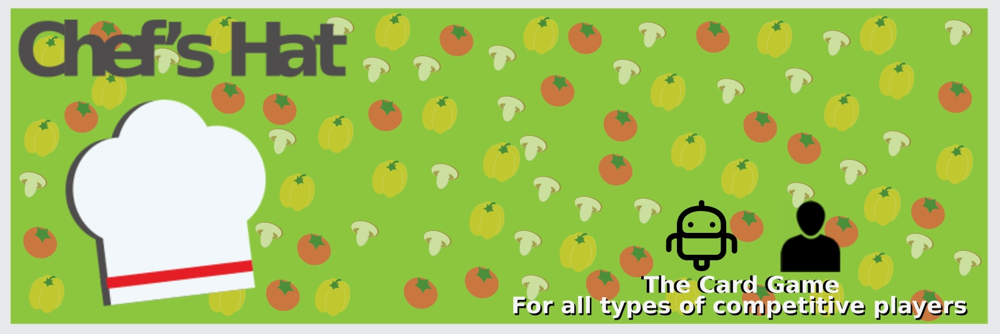

## ChefsHatGym V3

This repository holds the ChefsHatGym environment, which contains all the necessary tools to run, train and evaluate your agents while they play the Chef`s Hat game.

With this library, you will be able to:

* Encapsulate existing agents into the game
* Run the game locally, on your machine
* Run the game room as a server
* Connect agents to a server room and run games
* Export experimental results, game summaries and agents behavior on a easy-to-read format
* Evaluate agents using different evaluation tools and visualizations

Full documentation can be found here: [Documentation.](https://chefshatgym.readthedocs.io/en/latest/)

We also provide a list of existing plugins and extensions for this library:

### Chef`s Hat Run

The [Chef’s Hat Run](https://github.com/pablovin/chefsHat_run) is a web interface that allows the setup, follow-up and management of server-based rooms of the Chef\`s Hat. It is ideal to run local experiments with artificial agents, without the need to configure or code anything; To run server rooms and allow remote players to player; And to explore finished games, by using the interative plotting tools to visualize and extract important game statistics.

### Chef`s Hat Players Club

The [Chef’s Hat Player’s Club](https://github.com/pablovin/ChefsHatPlayersClub) is a collection of ready-to-use artificial agents. These agents were implemented, evaluated, and discussed in specific peer-reviewed publications and can be used anytime. If you want your agent to be included in the Player’s Club, message us.

### Chef`s Hat Play

[Chef`s Hat Play](https://github.com/pablovin/ChefsHat_Play) is a Unity interface that allows humans to play the game against other humans or artificial agents.

### Metrics Chef`s Hat

The [Metrics Chef`s Hat](https://github.com/lauratriglia/MetricsChefsHat) package includes the tools for creating different game behavior metrics that help to better understand and describe the agents. Developed and maintained by Laura Triglia.


### Nova

[Nova](https://github.com/nathaliarcauas/Nova) is a dynamic game narrator, used to describe and comment on a Chef`s Hat game. Developed and mantained by Nathalia Cauas.


### Simulated Games

We also provide a series of simulated games, inside the [Simulated Games.](https://github.com/pablovin/ChefsHatGYM/tree/master/Simulated_Games) folder.
Each of these games run for 1000 matches, and different combination of agents play them. They are provided as a ready-to-use resource for agent analysis, tools development or better understanding of the Chef`s Hat Simulator as a whole.


## The Chef's Hat Card game

 

The Chef's Hat Environment provides a simple and easy-to-use API, based on the OpenAI GYM interface, for implementing, embedding, deploying, and evaluating reinforcement learning agents.

Fora a complete overview on the development of the game, refer to:

- It's Food Fight! Introducing the Chef's Hat Card Game for Affective-Aware HRI (https://arxiv.org/abs/2002.11458)
- You Were Always on My Mind: Introducing Chef’s Hat and COPPER for Personalized Reinforcement Learning (https://www.frontiersin.org/articles/10.3389/frobt.2021.669990/full)
- The Chef's Hat rulebook  [The Chef's Hat rulebook.](gitImages/RulebookMenuv08.pdf)

If you want to have access to the game materials (cards and playing field), please contact us using the contact information at the end of the page.

## Chef`sHatGym Simulator

 

### Instalation

You can use our pip installation:

```python
   pip install chefshatgym

```
Refer to our full [documentation](https://chefshatgym.readthedocs.io/en/latest/) for a complete usage and development guide.
 

### Running a game locally
The basic structure of the simulator is a room, that will host four players, and initialize the game.
ChefsHatGym encapsulates the entire room structure. A local game can be started with a few lines of code:

```python
import asyncio
from rooms.room import Room
from agents.random_agent import RandomAgent

async def main():
    room = Room(run_remote_room=False, room_name="local_room", max_matches=1)

    players = [RandomAgent(name=f"P{i}", log_directory=room.room_dir) for i in range(4)]
    for p in players:
        room.connect_player(p)

    await room.run()
    print(room.final_scores)

asyncio.run(main())
```

For a more detailed example, check the [examples folder.](https://github.com/pablovin/ChefsHatGYM/tree/master/examples).

### Running a game remotely

ChefsHatGym can also host a room as a websocket server. Agents running on different machines can join the server and play together.

```python
# Server
import asyncio
from rooms.room import Room

async def main():
    room = Room(run_remote_room=True, room_name="server_room",
                room_password="secret", room_port=8765)
    await room.run()

asyncio.run(main())
```

Remote agents connect using the `remote_loop` method:

```python
import asyncio
from agents.random_agent import RandomAgent

async def main():
    agent = RandomAgent(
        "P1",
        run_remote=True,
        host="localhost",
        port=8765,
        room_name="server_room",
        room_password="secret",
    )
    await agent.remote_loop()

asyncio.run(main())
```

For complete examples, check the [examples folder.](https://github.com/pablovin/ChefsHatGYM/tree/master/examples)

### Chefs Hat Agents

ChefsHatGym provides an interface to encapsulate agents. It allows the extension of existing agents, but also the creation of new agents. Implementing from this interface allows your agents to be inserted in any Chef`s Hat game run by the simulator.

Running an agent from another machine is supported directly by the agent interface. By enabling `run_remote=True` and calling `remote_loop`, your agent gets all the local and remote functionality and can be used by the Chef`s Hat simulator.


Here is an example of an agent that only select random actions:
* [Random Agent](https://github.com/pablovin/ChefsHatGYM/blob/master/src/agents/random_agent.py)


## Legacy Plugins and Extensions

 ### Chef's Hat Online (ChefsHatGymV1)
   
   
The [Chef’s Hat Online](https://github.com/pablovin/ChefsHatOnline) encapsulates the Chef’s Hat Environment and allows a human to play against three agents. The system is built using a web platform, which allows you to deploy it on a web server and run it from any device. The data collected by the Chef’s Hat Online is presented in the same format as the Chef’s Hat Gym, and can be used to train or update agents, but also to leverage human performance.
 
 ### Moody Framework (ChefsHatGymV1)
 
  
  
 [Moody Framework]( https://github.com/pablovin/MoodyFramework) is a plugin that endowes each agent with an intrinsic state which is impacted by the agent's
  own actions. 
 

 ## Use and distribution policy

All the examples in this repository are distributed under a Non-Comercial license. If you use this environment, you have to agree with the following itens:

- To cite our associated references in any of your publication that make any use of these examples.
- To use the environment for research purpose only.
- To not provide the environment to any second parties.

## Citations

- Barros, P., Yalçın, Ö. N., Tanevska, A., & Sciutti, A. (2023). Incorporating rivalry in reinforcement learning for a competitive game. Neural Computing and Applications, 35(23), 16739-16752.

- Barros, P., & Sciutti, A. (2022). All by Myself: Learning individualized competitive behavior with a contrastive reinforcement learning optimization. Neural Networks, 150, 364-376.

- Barros, P., Yalçın, Ö. N., Tanevska, A., & Sciutti, A. (2022). Incorporating Rivalry in reinforcement learning for a competitive game. Neural Computing and Applications, 1-14.

- Barros, P., Tanevska, A., & Sciutti, A. (2021, January). Learning from learners: Adapting reinforcement learning agents to be competitive in a card game. In 2020 25th International Conference on Pattern Recognition (ICPR) (pp. 2716-2723). IEEE.

- Barros, P., Sciutti, A., Bloem, A. C., Hootsmans, I. M., Opheij, L. M., Toebosch, R. H., & Barakova, E. (2021, March). It's Food Fight! Designing the Chef's Hat Card Game for Affective-Aware HRI. In Companion of the 2021 ACM/IEEE International Conference on Human-Robot Interaction (pp. 524-528).

- Barros, P., Tanevska, A., Cruz, F., & Sciutti, A. (2020, October). Moody Learners-Explaining Competitive Behaviour of Reinforcement Learning Agents. In 2020 Joint IEEE 10th International Conference on Development and Learning and Epigenetic Robotics (ICDL-EpiRob) (pp. 1-8). IEEE.

- Barros, P., Sciutti, A., Bloem, A. C., Hootsmans, I. M., Opheij, L. M., Toebosch, R. H., & Barakova, E. (2021, March). It's food fight! Designing the chef's hat card game for affective-aware HRI. In Companion of the 2021 ACM/IEEE International Conference on Human-Robot Interaction (pp. 524-528).

## Events

### Chef`s Hat Cup: Revenge of the Agent!
Get more information here: https://www.chefshatcup.poli.br/home

### The First Chef's Hat Cup is online!
Get more information here: https://www.whisperproject.eu/chefshat#competition

## Contact

Pablo Barros - pablovin@gmail.com

- [Twitter](https://twitter.com/PBarros_br)
- [Google Scholar](https://scholar.google.com/citations?user=LU9tpkMAAAAJ)
