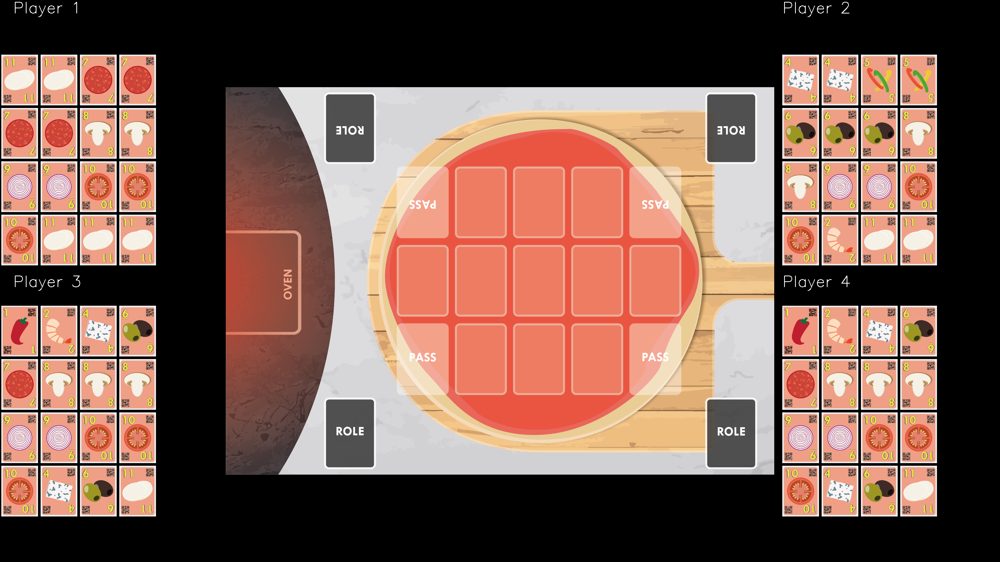

This repository holds the OpenGYM environment for the Chef's Hat card game.

## Chef's Hat Card game

 

Chef's Hat is a cardgame  designed with specific HRI requirements in mind, which allows it to be followed and modeled by artificial agents with ease. Also, the game mechanics were designed to evoke different affective interactions within the game, which can be easily perceived and displayed by a robot. Furthermore, the game elements were design to facilitate the extraction of the game state through the use of QR-codes and specific turn taking actions, which do not break the game flow.

Fora a complete overview on the development of the game, refer to:

- It's Food Fight! Introducing the Chef's Hat Card Game for Affective-Aware HRI (https://arxiv.org/abs/2002.11458)
- The Chef's Hat rulebook  [The Chef's Hat rulebook.](gitImages/RulebookMenuv08.pdf)

If you want to have access to the game materials (cards and playing field), please contact us using the contact information at the end of the page.

#### Summary of game rules

During each game there are three phases: Start of the game, Making Pizzas, End of the game. The game starts with the cards been shuffled and dealt with the players. Then, starting from the second game, the exchange of roles takes place based on the last games'  finishing positions. The player who finished first becomes the Chef, the one that finished second becomes the Sous-Chef, the one that finished third becomes the Waiter and the last one the Dishwasher. Once the roles are exchanged, the exchange of the cards starts. The Dishwasher has to give the two cards with the highest values to the Chef, who in return gives back two cards of their liking. The Waiter has to give their lowest valued card to the Sous-Chef, who in return gives one card of their liking.

If, after the exchange of roles, any of the players have two jokers at hand, they can perform a special action: in case of the Dishwasher, this is "Food Fight" (the hierarchy is inverted), in case of the other roles it is "Dinner is served" (there will be no card exchange during that game).

Once all of the cards and roles are exchanged, the game starts. The goal of each player is to discard all the cards at hand. They can do this by making a pizza by laying down the cards into the playing field, represented by a pizza dough. The person who possesses a Golden 11 card at hand starts making the first pizza of the game. A pizza is done when no one can, or wants, to lay down any ingredients anymore. A player can play cards by discarding their ingredient cards on the pizza base. To play cards, they need to be rarer (i.e. lowest face values) than the previously played cards. The ingredients are played from highest to the lowest number, that means from 11 to 1. Players can play multiple copies of an ingredient at once, but always have to play an equal or greater amount of copies than the previous player did. If a player cannot (or does not want) to play, they pass until the next pizza starts. A joker card is also available and when played together with other cards, it assumes their value. When played alone, the joker has the highest face value (12). Once everyone has passed, they start a new pizza by cleaning the playing field, and the last player to play an ingredient is the first one to start the new pizza.

## Chef's Hat OpenAI Gym Simulation Environment

This environment is freely available for scientific purposes and implements all the rules and mechanics of the Chef's Hat game.

For an in-depth look at the functioning of the environment, please refer to:
 - The Chef's Hat Simulation Environment for Reinforcement-Learning-Based Agents (https://arxiv.org/abs/2003.05861)

The environment is build based on the OpenAi Gym toolkit, so it implements a portable and reusable environment.
To complement the environment and help with the experimental simulations, we encapsulate the enviromment using the
ChefsHatExperimentHandler module.

The experiment handler runs a series of games. Each game is independent, but based on Chef's Hat rules and the
 end results of each game affects the roles of the next game.
 
 #### Space an Action definition
 
  
 
 The simulator represents the current game state for each player as the cards the player has at hand and the cards in the playing field. For each player, there are a total of 200 allowed actions: to discard one card of face value 1 represents one move or to discard 3 cards of face value 1 and a joker is another move, while passing is considered another move. Each player can only do one action per game turn.

Each action taken by a player is validated based on a look-up-table, created in real-time based on the player's hand and the cards in the playing field. This is a crucial step to guarantee that a taken action is allowed given the game context and to guarantee that the game rules are maintained.  The Figure above illustrates an example of calculated possible actions given a game state. The blue areas mark all the possible action states, while the gray areas mark actions that are not allowed due to the game's mechanics. We observed that, given this particular game state, this player would only be allowed to perform one of three actions (marked in green), while any other action (marked in red) would be considered as invalid and not would be carried on by the simulator. 

### Pre-requisites

Install the requirements from the Requirements.txt file.

### Implemented Agents

To run the experiment, you have to provide the experiment handler four agents. We include here the following
agents implementations:
 - Dummy agent Random: an agent that does not learn, and select all actions randomly based on the possible actions. (more info: https://arxiv.org/abs/2003.05861).
 - Dummy agent AlwaysOneCard: an agent that does not learn, and only select all actions randomly based on discarding o
 nly one card at a time.
 - DeepQL Agent (more info: https://arxiv.org/abs/2003.05861).
 - Advantage Actor-Critic Agent (more info: https://arxiv.org/abs/2004.04000)
 - Proximal Policy Optmization Agent (more info: https://arxiv.org/abs/2004.04000)
 
 ### Plugins
 
  
  
 - Moody Framework ( https://github.com/pablovin/MoodyFramework)
   - A plugin that endowes each agent with an intrinsic state which is impacted by the agent's
  own actions. 

### Simulation Data Structure

The environment creates a set of logs and metrics that can help to understand the game state and the agents'
behavior during the experiments. For each experiment, one folder is created with the following structure:

- Dataset : Holds the generated dataset with all the actions taken by the agents during the game
- Log: Holds the log of the game, if enabled, and the metrics .csv file with all the metrics of all players for all games.
- Model: Holds the learned models, per game, when using learning agents.
- Plots: Holds all the plots generated during the simulations.

##### Datasets

The environment saves a dataset, in the format of .pkl files, that stores the entire game state over all the performed experiments. 
The dataset can be used later on to create specific plots, or to render the game-play video.

##### Logs and Metrics

If requested, the environment saves a human-friendly log of all the experiments within the Log folder. This log, saved in simple
.txt form, can be used to perform human analysis on the game state, but also to identify anomalous behavior in long
simulations. It saves all the game state, player hand and board, actions taken, reward and number of invalida actions
per player turn.

Together with the log, the environment saves  the following metrics per player for the entire simulation: 
- The number of rounds per game.
- The number of victories. 
- The total averaged reward per game.
- The finishing positions.
- The number of invalid actions.

Also in the Log folder, the environment saves a metrics.csv file. This file contains the following metrics per player per game:

- Finishing position
- Average reward over the entire game
 - Number of passes for each game quarter
 - Number of discards for each game quarter
 
 The number of passes and discards are calculated for each game quarter (25% of the game duration), and help us to 
 understand the agents' strategy while playing the game.

##### Plots

The environment is able to create a series of plots to better understand the simulation.
The plots are created based on a saved dataset. Currently the following plots are available:
    
- "Experiment_Winners" - Victories histogram per game in a series of games.
- "Experiment_Rounds" - Number of rounds per game in a series of games.
- "Experiment_FinishingPosition" - Finishing position per player in a series of games.
- "Experiment_ActionsBehavior":"expActionBeh" - Distribution of each player's action behavior in a series of games.
- "Experiment_Reward" - Reward per player in a series of games.
- "Experiment_CorrectActions" - Number of valid actions performed by each player in a series of games.
- "Experiment_QValues" - Q-values for each action of each player in a sereis of games.
- "Experiment_Losses" - Training loss evolution of each training agent in a series of games.

##### Running experiments 

Currently, the environment implements the following experiments and examples:
 - run_General_Experiment.py - Run an experiment composed of four agents and a series of games.
 - Experiments_Media/run_CreateVideoFromDataset.py - Generate videos from collected datasets.
 - Experiments_Media/run_CreatePlotFromDataset.py  - Generate  plots from collected datasets.
 - Experiments_Optmization folder contains examples on how to run an agent optmization based on Hyperopt.
 - Experiments_Publications folder contains the following implementations:
    - (Submitted) IROS_2020: Barros, P., Sciutti, A., Hootsmans, I. M., Opheij, L. M., Toebosch, R. H., & Barakova, E. (2020) The Chef's Hat Simulation Environment for Reinforcement-Learning-Based Agents. arXiv preprint arXiv:2003.05861. (https://arxiv.org/abs/2003.05861)
    - (Submitted) ICPR2020: Barros, P., Tanevska, A., & Sciutti, A. (2020). Learning from Learners: Adapting Reinforcement Learning Agents to be Competitive in a Card Game. arXiv preprint arXiv:2004.04000.
 
 ##### Videos
 
 The simulator has a specific funcionality that reads a given dataset and generates an entire video of that gameplay.
 The video can be used to evaluate a specific behavior, or just to illustrate how the agents play the game.
 The following link directs to a video example:
 
 
 

 ## Use and distribution policy

All the examples in this repository are distributed under a Non-Comercial license. If you use this environment, you have to agree with the following itens:

- To cite our associated references in any of your publication that make any use of these examples.
- To use the environment for research purpose only.
- To not provide the environment to any second parties.

## Citations

- Barros, P., Sciutti, A., Hootsmans, I. M., Opheij, L. M., Toebosch, R. H., & Barakova, E. (2020). It's Food Fight! Introducing the Chef's Hat Card Game for Affective-Aware HRI. Accepted at the HRI2020
  Workshop on Exploring Creative Content in Social Robotics! arXiv preprint arXiv:2002.11458.

- Barros, P., Sciutti, A., Hootsmans, I. M., Opheij, L. M., Toebosch, R. H., & Barakova, E. (2020) The Chef's Hat Simulation Environment for Reinforcement-Learning-Based Agents. arXiv preprint arXiv:2003.05861.

- Barros, P., Tanevska, A., & Sciutti, A. (2020). Learning from Learners: Adapting Reinforcement Learning Agents to be Competitive in a Card Game. arXiv preprint arXiv:2004.04000.
## Contact

Pablo Barros - pablo.alvesdebarros@iit.it

- [http://pablobarros.net](http://pablobarros.net)
- [Twitter](https://twitter.com/PBarros_br)
- [Google Scholar](https://scholar.google.com/citations?user=LU9tpkMAAAAJ)
