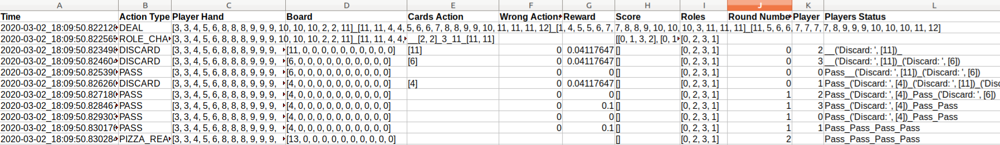
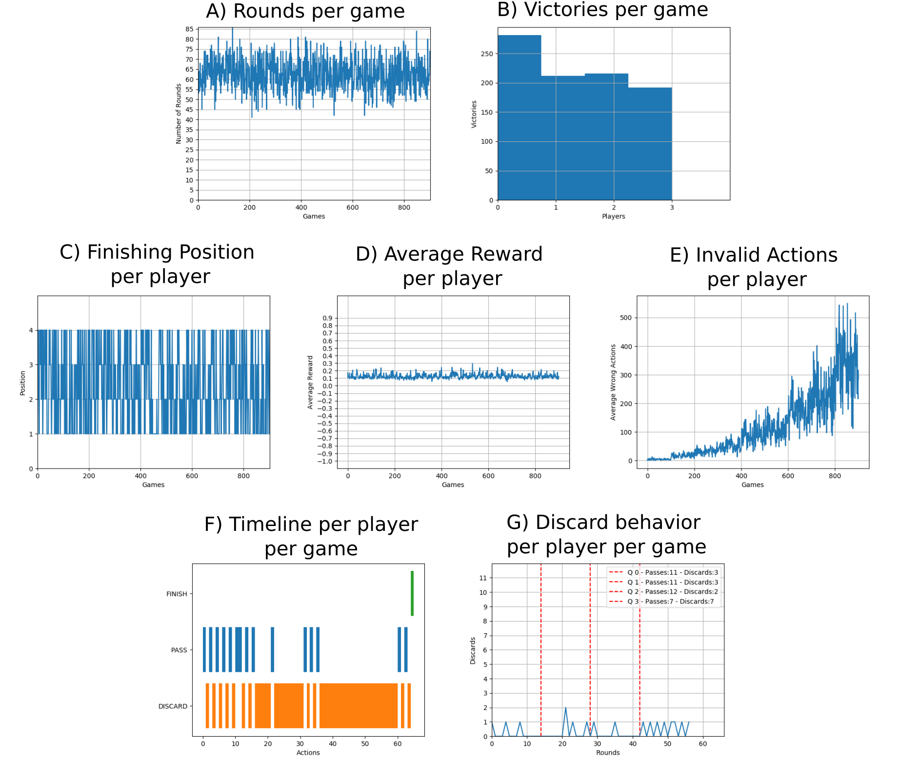
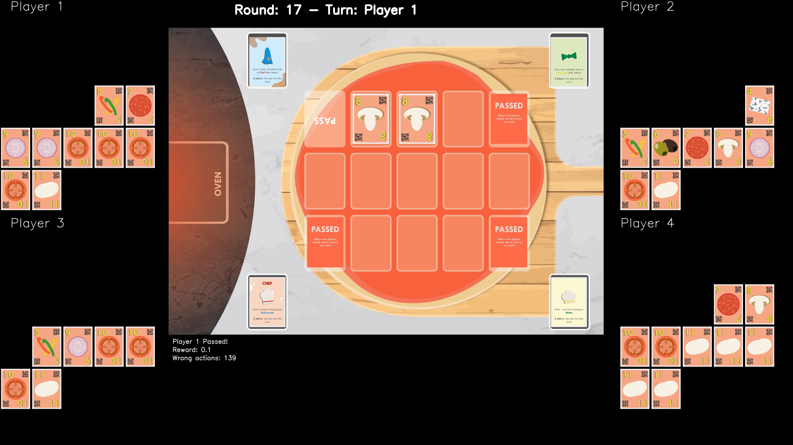

This repository holds the OpenGYM environment for the Chef's Hat card game.

## Chef's Hat Card game

 

Chef's Hat was designed with specific HRI requirements in mind, which allows it to be followed and modeled by artificial agents with ease. Also, the game mechanics were designed to evoke different affective interactions within the game, which can be easily perceived and displayed by a robot. Furthermore, the game elements were design to facilitate the extraction of the game state through the use of QR-codes and specific turn taking actions, which do not break the game flow.

Fora a complete overview on the development of the game, refer to:

- It's Food Fight! Introducing the Chef's Hat Card Game for Affective-Aware HRI (https://arxiv.org/abs/2002.11458)

If you want to have access to the game materials (cards and playing field), please contact us using the contact information at the end of the page.

## Chef's Hat OpenAI Gym Simulation Environment

This environment is freely available for scientific purposes and implements all the rules and mechanics of the Chef's Hat game.

for an in-depth look at the functioning of the environment, please refer to:
 - The Chef's Hat Simulation Environment for Reinforcement-Learning-Based Agents (https://arxiv.org/abs/2003.05861)

The environment is build based on the OpenAi Gym toolkit, so it implements a portable and reusable environment.
To complement the environment and help with the experimental simulations, we encapsulate the enviromment using the
ChefsHatExperimentHandler module.

The experiment handler runs a series of games. Each game is independent, but based on Chef's Hat rules, the finishing position
of each game affects the roles of the next game.

### Pre-requisites

Install the requirements from the Requirements.txt file.

### Agents

To run the experiment, you have to provide the experiment handler four agents. We include here the following
agents implementations:
 - Dummy agent Random: an agent that does not learn, and select all actions randomly based on the possible actions. (more info: https://arxiv.org/abs/2003.05861).
 - Dummy agent AlwaysOneCard: an agent that does not learn, and only select all actions randomly based on discarding o
 nly one card at a time.
 - DeepQL Agent: an agent that learns how to play the game based on deep Q-learning. (more info: https://arxiv.org/abs/2003.05861).

### Simulation Data Structure

The environment creates a set of logs and metrics that can help to understand the game state and the agents'
behavior during the experiments. For each experiment, one folder is created with the following structure:

- Dataset : Holds the generated dataset with all the actions taken by the agents during the game
- Log: Holds the log of the game, if enabled, and the metrics .csv file with all the metrics of all players for all games.
- Model: Holds the learned models, per game, when using learning agents.
- Plots: Holds all the plots generated during the simulations.

##### Datasets

The environment saves a dataset, in the format of .csv files, that stores the dated game state, the taken actions, and game
events that happen during one game play. The dataset is used later on to create a game-play video, and to extract specific
metrics of that gameplay.

Our Examples folder holds specific examples of recorded datasets.

##### Logs and Metrics

If requested, the environment saves a human-friendly log of all the experiments within the Log folder. This log, saved in simple
.txt form, can be used to perform human analysis on the game state, but also to identify anomalous behavior in long
simulations. It saves all the game state, player hand and board, actions taken, reward and number of invalida actions
per player turn.

Together with the log, the environment saves  the following metrics per player for the entire simulation: 
- The number of rounds per game.
- The number of victories. 
- The total averaged reward per game.
- The finishing positions.
- The number of invalid actions.

Also in the Log folder, the environment saves a metrics.csv file. This file contains the following metrics per player per game:

- Finishing position
- Average reward over the entire game
 - Number of passes for each game quarter
 - Number of discards for each game quarter
 
 The number of passes and discards are calculated for each game quarter (25% of the game duration), and help us to 
 understand the agents' strategy while playing the game.

##### Plots

The environment calculates a series of plots to better understand the simulation. The plots folder holds:

- A) Number of rounds per game
- B) Victories histogram per game
- C) Finishing position per player
- D) Reward valid actions per player
- E) Invalid actions per player
- F) Players timeline per game
- G) The discard behavior of each player per game

### Funcionalities

Currently, the environment implements the following functionalities:
 - runExperiment.py illustrates how to run an experiment composed of four agents and a series of games.
 - generateVideos.py illustrates how to generate videos from collected datasets.
 - generateTimeLine.py illustrates how to generate timeline plots from collected datasets.
 - optmizeAgent.py illustrates how to run an agent optmization based on Hyperopt.
 
 ##### Videos
 
 The simulator has a specific funcionality that reads a given dataset and generates an entire video of that gameplay.
 The video can be used to evaluate a specific behavior, or just to illustrate how the agents play the game.
 The following link directs to a video example:
 
 

## Examples

The Examples folder contains the datasets and generated videos of two conditions: Running all four agents as random agents, and running all four agents as learning agents.

 ## Use and distribution policy

All the examples in this repository are distributed under a Non-Comercial license. If you use this environment, you have to agree with the following itens:

- To cite our associated references in any of your publication that make any use of these examples.
- To use the environment for research purpose only.
- To not provide the environment to any second parties.

## Citations

- Barros, P., Sciutti, A., Hootsmans, I. M., Opheij, L. M., Toebosch, R. H., & Barakova, E. (2020). It's Food Fight! Introducing the Chef's Hat Card Game for Affective-Aware HRI. arXiv preprint arXiv:2002.11458.

- Barros, P., Sciutti, A., Hootsmans, I. M., Opheij, L. M., Toebosch, R. H., & Barakova, E. (2020) The Chef's Hat Simulation Environment for Reinforcement-Learning-Based Agents. arXiv preprint arXiv:2003.05861.

## Contact

Pablo Barros - pablo.alvesdebarros@iit.it

- [http://pablobarros.net](http://pablobarros.net)
- [Twitter](https://twitter.com/PBarros_br)
- [Google Scholar](https://scholar.google.com/citations?user=LU9tpkMAAAAJ)
