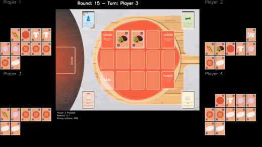

.. Chef's Hat Gym documentation master file, created by
   sphinx-quickstart on Mon Apr 12 10:43:31 2021.
   You can adapt this file completely to your liking, but it should at least
   contain the root `toctree` directive.

Welcome to Chef's Hat Environment documentation!
================================================

   
This project aims at providing a multi-agent competitive card game for training and evaluating different learning agents.
The Chef's Hat Environment provides a simple and easy-to-use API, based on the OpenAI GYM interface, for implementing, embedding, deploying, and evaluating reinforcement learning agents.

.. toctree::
   :maxdepth: 1
   :caption: Contents:
 
   quickstart
   intro
   evalEnv
   ChefsHatGym
   license
   contact
   
Acknowledgment
==============
This environment and all its development is supported by a Starting Grant from the European Research Council (ERC) under the European Union's Horizon 2020 research and innovation programme. G.A. No 804388, wHiSPER.

