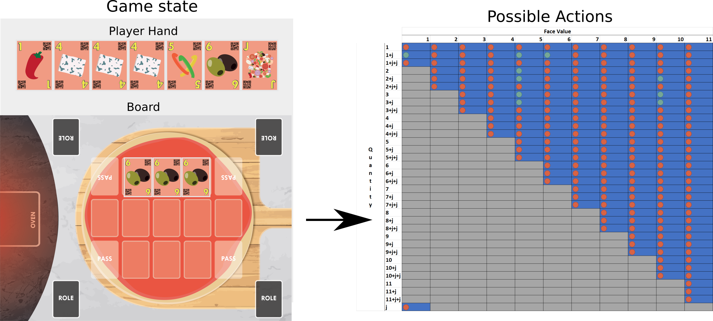

Introduction
============

The Chef's Hat Game 
^^^^^^^^^^^^^^^^^^^

During each game there are three phases: Start of the game, Making Pizzas, End of the game. The game starts with the cards been shuffled and dealt with by the players. Then, starting from the second game, the exchange of roles takes place based on the last games' finishing positions. The player who finished first becomes the Chef, the one that finished second becomes the Sous-Chef, the one that finished third becomes the Waiter, and the last one the Dishwasher. Once the roles are exchanged, the exchange of the cards starts. The Dishwasher has to give the two cards with the highest values to the Chef, who in return gives back two cards of their liking. The Waiter has to give their lowest valued card to the Sous-Chef, who in return gives one card of their liking.

If, after the exchange of roles, any of the players have two jokers at hand, they can perform a special action: in the case of the Dishwasher, this is "Food Fight" (the hierarchy is inverted), in case of the other roles it is "Dinner is served" (there will be no card exchange during that game).

Once all of the cards and roles are exchanged, the game starts. The goal of each player is to discard all the cards at hand. They can do this by making a pizza by laying down the cards into the playing field, represented by a pizza dough. The person who possesses a Golden 11 card at hand starts making the first pizza of the game. A pizza is done when no one can, or wants, to lay down any ingredients anymore. A player can play cards by discarding their ingredient cards on the pizza base. To play cards, they need to be rarer (i.e. lowest face values) than the previously played cards. The ingredients are played from highest to the lowest number, which means from 11 to 1. Players can play multiple copies of an ingredient at once, but always have to play an equal or greater amount of copies than the previous player did. If a player cannot (or does not want) to play, they pass until the next pizza starts. A joker card is also available and when played together with other cards, it assumes their value. When played alone, the joker has the highest face value (12). Once everyone has passed, they start a new pizza by cleaning the playing field, and the last player to play an ingredient is the first one to start the new pizza.

.. image:: ../../gitImages/ChefsHatAlgorithm.png
	:alt: Chef's Hat Card Game
	:align: center 
	

Action and Observation Space
^^^^^^^^^^^^^^^^^^^^^^^^^^^^
	
The environment represents the current game state for each player as the concatenation of the cards the player has at hand, the current cards in the playing field, and the possible actions for that move. For each player, there are a total of 200 allowed actions: to discard one card of face value 1 represents one move or to discard 3 cards of face value 1 and a joker is another move, while passing is considered another move. Each player can only do one action per game turn.

Each action taken by a player is validated based on a look-up table, the possible actions, created in real-time based on the player's hand and the cards in the playing field. This is a crucial step to guarantee that a taken action is allowed given the game context and to guarantee that the game rules are maintained. The Figure above illustrates an example of calculated possible actions given a game state. The blue areas mark all the possible action states, while the gray areas mark actions that are not allowed due to the game's mechanics. We observed that, given this particular game state, this player would only be allowed to perform one of three actions (marked in green), while any other action (marked in red) would be considered as invalid and not would be carried on by the simulator.

Rewards
^^^^^^^

The environment requests that every implemented agent have its reward definition. It has, however, a simple pre-defined reward: 

.. code-block:: python
   
	class RewardOnlyWinning():

	    rewardName = "OnlyWinning"

	    def getReward(self,  thisPlayerPosition, matchFinished):

		reward = - 0.001
		if matchFinished:
		    if thisPlayerPosition == 0:
			reward = 1

		return reward

In this reward, an agent will receive a maximum reward (1), if, and only if, it finished a game in the first position, otherwise it receives a small (-0.001) reward.

Score
^^^^^

After each match of the Chef's Hat game, players are rewarded with points (from 3 to 0, depending on the finishing position). We also calculate a performance score, based on the following:

.. code-block:: python
	performanceScore = ((points*10)/rounds)/matches

The performance score allows us to represent better the behavior of an agent in terms of the number of rounds it needed to win the match, and number of matches needed to win the game.

Dataset
^^^^^^^

The environment allows the generation of datasets, which are .csv files that contain all the actions of the entire game in an easy-to-parse format. These datasets can be used to collect data from players, to generate analysis and interpretation about the game, or to log an entire match, for example.

The IAgent Interface
^^^^^^^^^^^^^^^^^^^^

You can create a new agent by implementing the iAgent interface. Each new agent must implement the getAction() and getReward() functions, which are necessary to maintain the common game flow. To create a valid agent, the getAction() function must return a one-hot encoding for the 200 allowed actions. The getReward() must return a float number with the agent's reward.

Besides these methods, each agent can implement the following methods:

.. list-table:: Title
   :widths: auto
   :header-rows: 1

   * - Method
     - Description
   * - actionUpdate
     - It can be called when an agent performs an action, and can be used to update the agent's decision-making process
   * - matchUpdate
     - It can be called when a match is over
   * - observeOthers
     - It will be called as soon as any of the opponents makes an action

Chef's Hat Players Club
^^^^^^^^^^^^^^^^^^^^^^^

Besides the naive random agent present in the Chef's Hat environment, we also let available the `Chef's Hat Player's Club  <https://github.com/pablovin/ChefsHatPlayersClub>`_, a collection of ready-to-use players. Each of these agents were implemented, evaluated, and discussed in specific peer-reviewed publications and can be used at any time. If you want your agent to be included in the Player's Club, send us a message.

Chef's Hat Online
^^^^^^^^^^^^^^^^^

We also have available the `Chef's Hat Online <https://github.com/pablovin/ChefsHatOnline>`_, which encapsulates the Chef's Hat Environment and allow a human to play against three agents. The system is built using a web platform, which allows you to deploy it on a web server and run it from any device. The data collected by the Chef's Hat Online is presented in the same format as the Chef's Hat Gym, and can be used to train or update agents, but also to leverage human performance.

